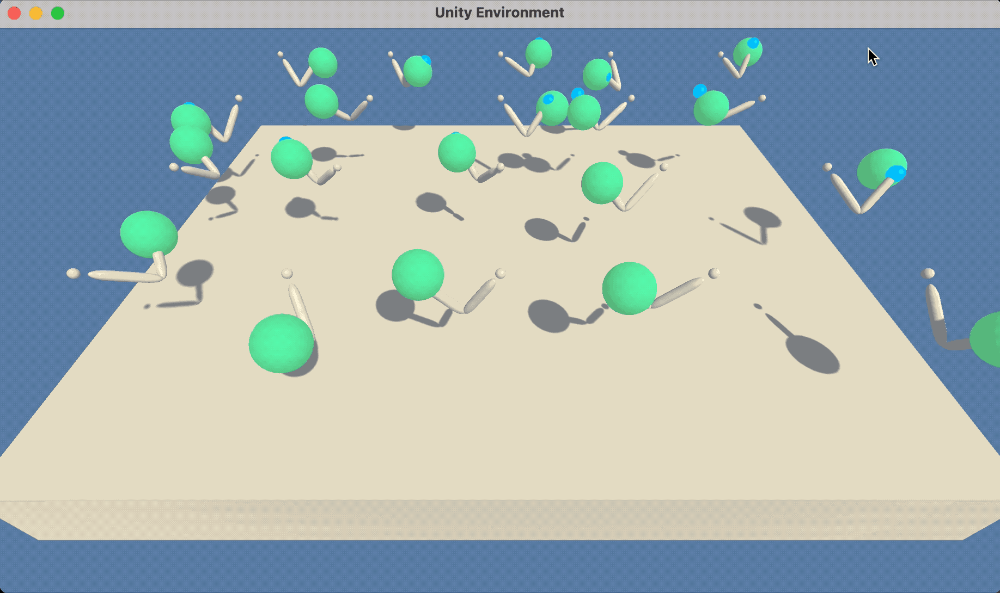

# Project 2: Continuous Control

### Introduction

This project works with a unity-agent variant called, [Reacher](https://github.com/Unity-Technologies/ml-agents/blob/master/docs/Learning-Environment-Examples.md#reacher).

## Goal 

The goal of the project was to train a robotic arm to follow a target.  The details of the implementation and results are provided in `Report.md`.

## Download the Environment

1. The modified environment can be downloaded from one of the links below.  

    - **_Twenty (20) Agents_**
        - Linux: [click here](https://s3-us-west-1.amazonaws.com/udacity-drlnd/P2/Reacher/Reacher_Linux.zip)
        - Mac OSX: [click here](https://s3-us-west-1.amazonaws.com/udacity-drlnd/P2/Reacher/Reacher.app.zip)
        - Windows (32-bit): [click here](https://s3-us-west-1.amazonaws.com/udacity-drlnd/P2/Reacher/Reacher_Windows_x86.zip)
        - Windows (64-bit): [click here](https://s3-us-west-1.amazonaws.com/udacity-drlnd/P2/Reacher/Reacher_Windows_x86_64.zip)

2. Place the file in the repository and decompress the file. 

## Instructions

- Run the  `Continuous_Control.py` to train.

- Run the `test_agent.py` to load and run the trained agent.

