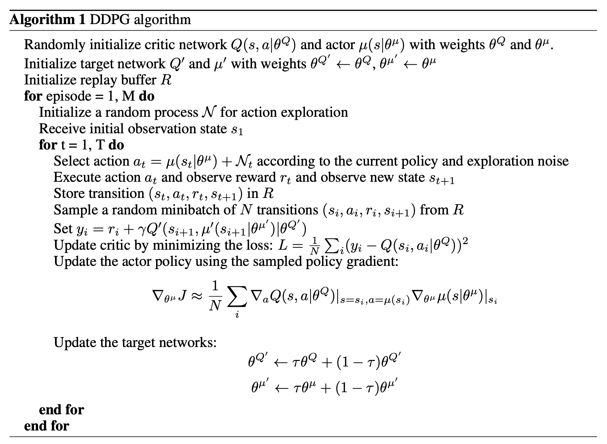
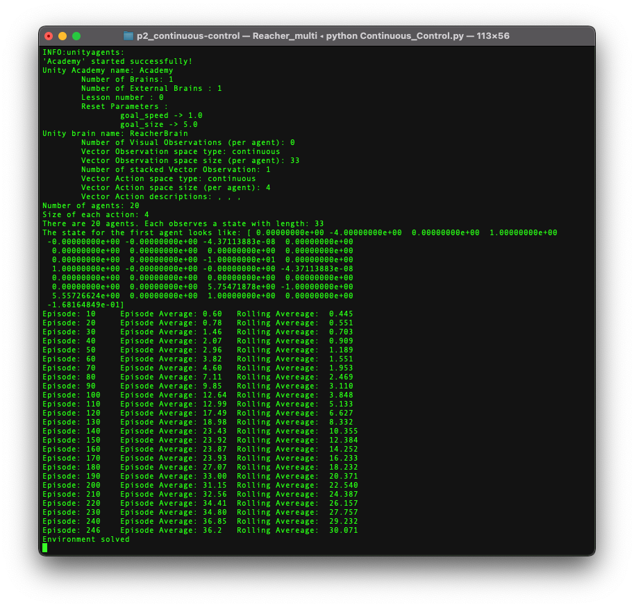
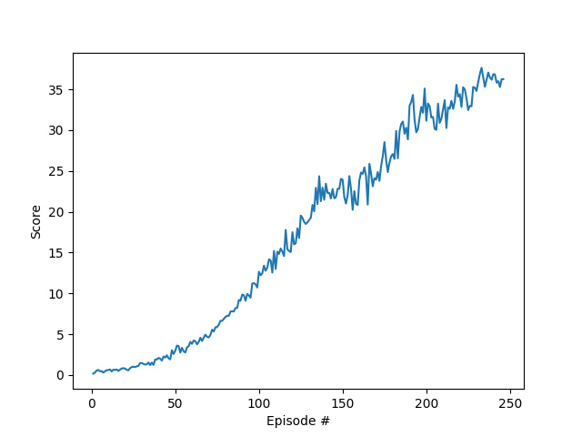

# Deep Deterministic Policy Gradient (DDPG) for robotic control

## Overview
The goal of this project was to demonstrate a deep reinforcement learning solution to a robotic control problem. The problem is described as follows:

### Environment

In this environment, a double-jointed arm can move to target locations. A reward of +0.1 is provided for each step that the agent's hand is in the goal location. Thus, the goal of the agent is to maintain its position at the target location for as many time steps as possible.

The observation space consists of 33 variables corresponding to position, rotation, velocity, and angular velocities of the arm. Each action is a vector with four numbers, corresponding to torque applicable to two joints. Every entry in the action vector should be a number between -1 and 1.

### Training

For this project, I used a Unity environment containing 20 identical agents, each with its own copy of the environment. This environment was useful for exploring algorithms like [PPO](https://arxiv.org/pdf/1707.06347.pdf), [A3C](https://arxiv.org/pdf/1602.01783.pdf), and [D4PG](https://openreview.net/pdf?id=SyZipzbCb) that use multiple (non-interacting, parallel) copies of the same agent to distribute the task of gathering experience.  

### Objective

To take into account the presence of many agents, the agents must get an average score of +30 (over 100 consecutive episodes, and over all agents).  Specifically,
- After each episode, I add up the rewards that each agent received (without discounting), to get a score for each agent.  This yields 20 (potentially different) scores.  I then take the average of these 20 scores. 
- This yields an **average score** for each episode (where the average is over all 20 agents).

The environment is considered solved, when the average (over 100 episodes) of those average scores is at least +30. 

## Approach

I chose DDPG [Lillicrap et al, 2015] to solve the problem because of its straight forward implementation, but A3C was also a candidate. DDPG is an actor-critic, model-free algorithm based on the deterministic policy gradient that can operate over continuous action space. To reiterate, unlike Q-learning algorithms, DDPG is designed specifically for continuous actions spaces.

DDPG is an actor-critic method. The algorithm maintains a parameterized actor function $\mu (s|θ^μ)$ which specifies the current policy by deterministically mapping states to a specific actions. The critic $\ Q(s, a)$ is learned using the Bellman equation as in Q-learning.  The algorithm is outlined below.




## Model Architecture Specifics

Several aspects of the algorithm design are worth highlighting:

-- Update Frequency: Since 20 agents were being used in the training and each agent added its experience to a replay buffer that was shared by all agents, the (local) actor and critic networks were updated 10 times in a row after every 20 timesteps. This was done to increase the stability of training.

-- Experience Replay: As discussed by Lillicrap, the network was trained off-policy with samples from a replay buffer to minimize correlations between samples. The buffer contained tuples of the form  $\ (s_t, a_t, r_t, s_{t+1}, done)$.


-- Target Networks: The networks were trained with target networks $\ (μ'$ and $\ Q')$ to give consistent targets during the temporal difference updates.

-- Soft Updates: To counter the potential for divergence in updating the networks, Lillicrap's "soft updates" were used. Instead of copying weights during updates, the soft updates change the weights slowly by mixing the target and local weights via $\ θ' ← τθ + (1 − τ)θ'$ with $\ τ ≪ 1$.

-- Activation Functions: Several activation functions were evaluated to improve and stabilize learning.  Ultimately the leak_rulu activation was chosen over rulu as it showed better contribution to convergence.

-- Network Size: Several network sizes were used, ranging from two layers with many nodes ([600, 400]) to three layers with fewer nodes ([256, 128, 128]). The deeper and narrower network was ultimate chosen for the critic and the shallow and narrow network chosen for the actor.

-- Normalization: Since the training was being done in batches, the inputs to the networks were normalized.  At first this was attempted with standard scalers, but ultimately pytorch's `BatchNorm1d()` function was used. 

-- Network Initialization: To improve stability and break symmetries in hidden layers [Bengio et al], the network weights were initialized with pytorch's `xavier_uniform_()` function.

## Training Hyperparameters

The following hyperparameters, mostly found through trial and error, were used in the training process:
```python
BUFFER_SIZE = int(1e6)  # replay buffer size
BATCH_SIZE = 1024       # minibatch size 
GAMMA = 0.99            # discount factor
TAU = 1e-3              # interpolation parameter for soft update
LR_ACTOR = 1e-4         # learning rate for actor
LR_CRITIC = 3.0e-4      # learning rate for critic
LEARN_EVERY = 20        # how many time steps between learning
UPDATE_TIMES = 10       # number or times to update each learning event
```

# Results

## Training

Together, the agents achieved the goal of a score > 30 over the last 100 episodes at 246 total episodes. The log is shown in the figure below.



The plot of the training curve is shown in the following plot.



## Agent Performance

The following video shows the trained agents performing the task. Note how the arms follow the targets.


# Improvement

This particular implementation required significant and time consuming parameter tuning. Its robustness on other, similar problems is uncertain. Follow on work could include exploring implementations of A2C and A3C. The most promising of the alternate algorithms is likely D4PG or Distributed Distributional Deep Deterministic Policy Gradient [Barth-Maron et al, 2018]. This algorithm combine the DDPG technique with a number of additional, simple improvements such as the use of N-step returns and prioritized experience replay. 

In addition, other deep learning tricks could be implemented such as decaying learning rates, dropout layers within the models, alternative dynamic exploration/exploitation strategies, etc.